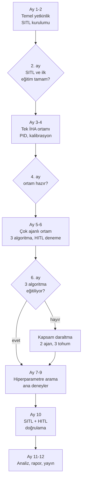
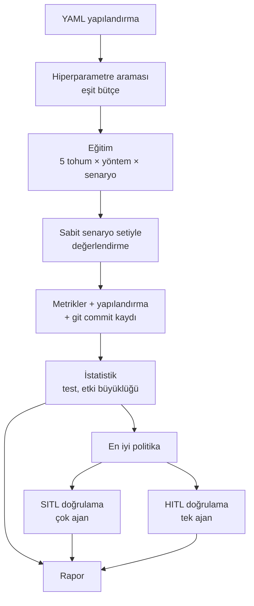
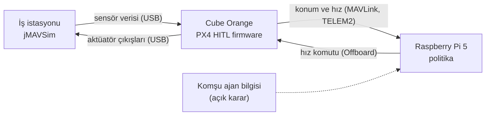

# Akış Diyagramları

## 1. Proje akışı

Her kontrol noktası bir sonraki aşamaya geçmeden önce karşılanması gereken çıktıyı gösterir; 6. ayda algoritmalar eğitilemiyorsa kapsam daraltılır ama takvim korunur.

## 2. Deney hattı

Her sonuç, onu üreten yapılandırma ve kod sürümüyle birlikte kaydedildiği için rapordaki her sayı geriye doğru izlenebilir.

## 3. HITL veri akışı

Uçuş fiziği iş istasyonunda, uçuş kontrol yazılımı gerçek kartta, politika ise Raspberry Pi'da çalışır. Kesikli çizgi, TRD'de açık bırakılan komşu ajan bilgisinin nereden geleceği sorusunu gösterir.
